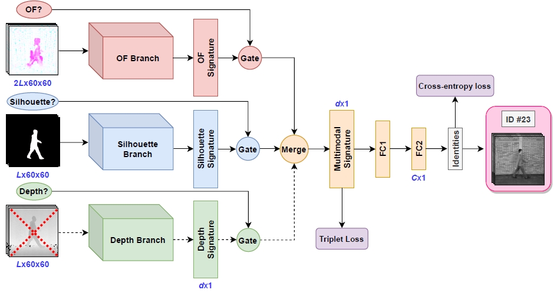
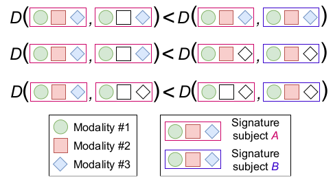

# UGaitNet: Multimodal gait recognition with missing input modalities

Support code for paper accepted for publication at IEEE Transactions on Information Forensics and Security.

This work extends [https://github.com/avagait/gaitmiss](https://github.com/avagait/gaitmiss)

__Code__: coming soon!  
Although you can start playing with the Google Colab notebooks available here: [https://github.com/avagait/gaitutils](https://github.com/avagait/gaitutils)

## Abstract
Gait recognition systems typically rely solely on silhouettes for extracting gait signatures. Nevertheless, these approaches struggle with changes in body shape and dynamic backgrounds; a problem that can be alleviated by learning from multiple modalities. However, in many real-life systems some modalities can be missing, and therefore most existing multimodal frameworks fail to cope with missing modalities. To tackle this problem, in this work, we propose UGaitNet, a unifying framework for gait recognition, robust to missing modalities. UGaitNet handles and mingles various types and combinations of input modalities, i.e. pixel gray value, optical flow, depth maps, and silhouettes, while being camera agnostic. We evaluate UGaitNet on two public datasets for gait recognition: CASIA-B and TUM-GAID, and show that it obtains compact and state-of-the-art gait descriptors when leveraging multiple or missing modalities. Finally, we show that UGaitNet with optical flow and grayscale inputs achieves almost perfect (98.9%) recognition accuracy on CASIA-B (same-view “normal”) and 100% on TUM-GAID (“ellapsed time”). 

## Proposed architecture

Input: (OF?, Silhouette?, Depth? ellipses) binary input units indicating whether the modality is available – here, depth is not available (dashed red cross); (volumes) sequences of _L_ frames for the different modalities. After fusing the single-modality signatures, a multimodal gait signature of _d_ dimensions is further compressed by FC1. The final FC2 contains _C_ classes (used just for training).  
The proposed model is depicted in the following figure:  

At training, the network learns multimodal signatures so that the distance _D_ between a pair of signatures of the same subject is lower than the distance between signatures of different subjects, independently of the modalities used to generate the signatures. To imitate test situations, some modalities are disabled (i.e. missing) at training (empty shapes).

## References
M. Marín-Jiménez, F. Castro, R. Delgado-Escaño, V. Kalogeiton,  N. Guil. _"UGaitNet: Multimodal gait recognition with missing input modalities"_. IEEE TIFS, 2021

